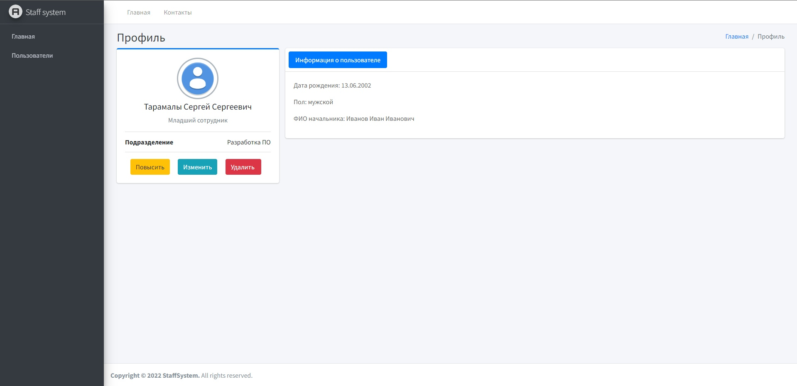
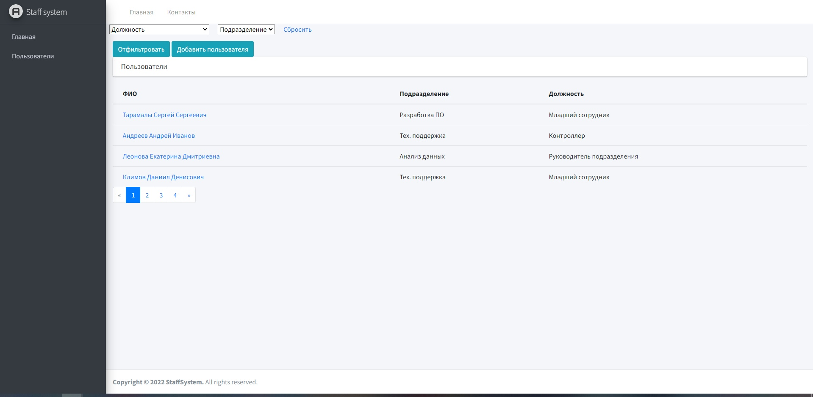
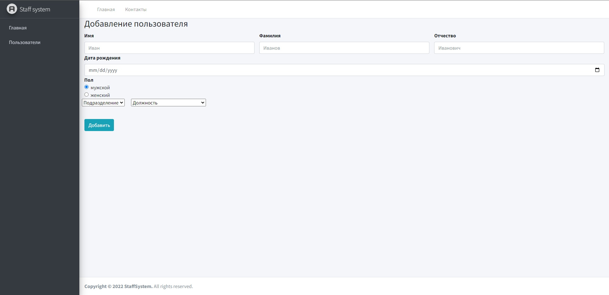
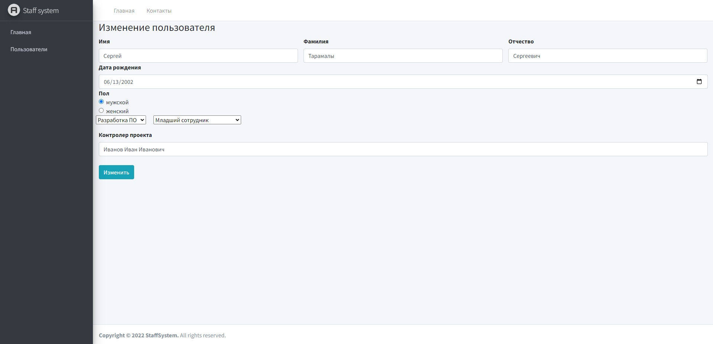

# staff-system
## Test task for internship in deeplay.
---

The created application solves the following tasks:
* add, delete and update users;
* get a list of users and filter by position and department;
* promotion user

## How to use
---
The application uses a SQLite database which already stores the test data (users) and resides in the project's repository. Therefore, you do not need to configure a connection to the database, just open src.sln file and **run** the **StaffSystem.Web** module.

## Several screenshots showing the UI of the program
User profile

Select users

Add new user

Edit user
